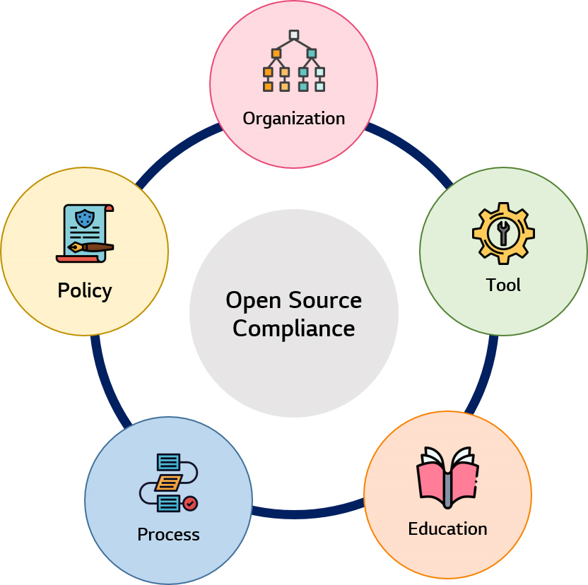

# Introduction

Software를 개발하면서 Open Source를 사용하는 것은 개발 기간 단축 및 비용 절감 등 많은 이점들로 인해 선택이 아닌 필수가 되었습니다. 회사에서 개발시 수많은 Open Source를 사용하면서 올바르게 사용하고 있는지 고민한 적이 있으신가요?

Open Source를 사용하거나 Open Source Community 기여 활동을 하는 조직이라면 지식 재산을 보호하고 Compliance Risk를 완화하기 위해 필요한 활동들이 존재합니다. 이러한 활동을 Open Source Compliance 활동이라고 하며, Open Source Compliance를 구축하기 위한 필수 요소는 크게 5가지로 볼 수 있습니다.

<br>

### Open Source Compliance를 위한 필수 요소

<p align="center"></p>

본 가이드에서는 각각의 요소를 차례대로 소개하고, 유용할만한 참고 자료들을 공유하고자 합니다. 특히 Policy와 Process에서는 LG Open Source의 [Core value](https://lge-oss.github.io/about/)에 따라 LG전자의 [Open Source Policy](../policy/osc_policy.md)와 [Open Source Compliance Process](../process/osc_process/README.md)를 각각 공개하였습니다.

1. [Organization](../organization/ospo.md)
2. [Policy](../policy/osc_policy.md)
3. [Process](../process/osc_process/README.md)
4. [Tool](../tool/osc_tool.md)
5. [Education](../education/osc_education.md)

<br>

해당 가이드의 공개를 작은 seed로, Open Source를 사용하고 기여하는 모든 사람들이 진정한 Open Source 가치를 생각하며 Compliance를 지킬 수 있었으면 합니다.

LG Open Source Guide 페이지에 작성된 모든 콘텐츠는 CC-BY-4.0 License하에 이용하실 수 있습니다.

<br>
<br>

```note
## Reference

- Linux Foundation resources : [https://www.linuxfoundation.org/resources/open-source-guides](https://www.linuxfoundation.org/resources/open-source-guides/creating-an-open-source-program/)
- OpenChain : [https://www.openchainproject.org/resources](https://www.openchainproject.org/resources)
```

<br>
