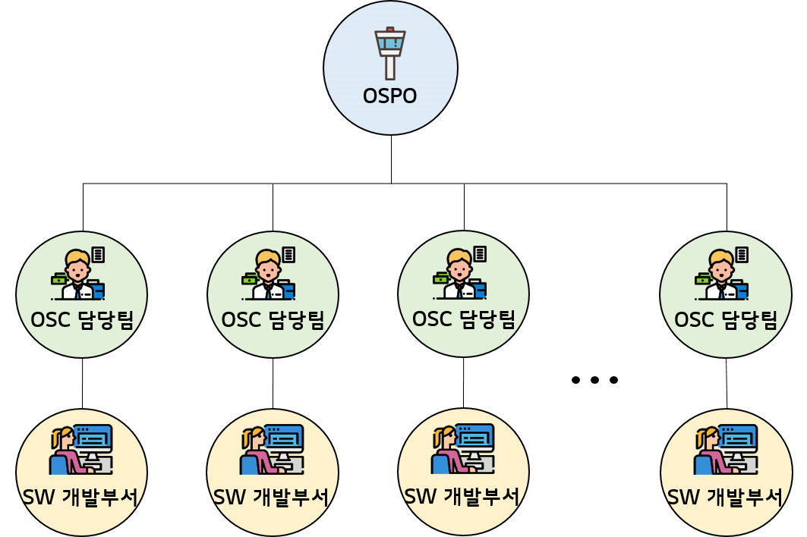

# OSPO

**OSPO** \(Open Source Program Office\)는 회사 내 효율적인 오픈 소스 관리와 Open Source Compliance Risk를 감소시키기 위해 구성된 센터 조직을 의미합니다. OSPO는 Open Source 사용 및 배포에 대한 audit 및 기타 정책을 구성하는 Open Source Compliance 활동뿐만 아니라 사내 SW 개발자를 위한 교육, 사내 Open Source 문화 확산 및 Open Source Community 참여 활성화와 같은 회사의 전체적인 Open Source 전략을 구축하는 역할을 수행할 수 있습니다.

 

## OSPO 운영 모델

OSPO는 주로 중앙 집중식\(centralized\) 모델로 운영됩니다. 이를 위해 사업부 또는 프로젝트 단위의 SW 개발부서는 부서 내 또는 연관 부서 내에 OSC 담당팀을 운영합니다.

**OSC 담당팀**은 해당 **SW 개발부서**의 Open Source Copliance Risk 관련 업무를 총괄하는 역할을 수행합니다. 이를 위해 OSC 담당팀은 OSPO와 협업하여 조직 내 SW 개발부서에 OSC 활동을 안내할 수 있어야 합니다.

 

