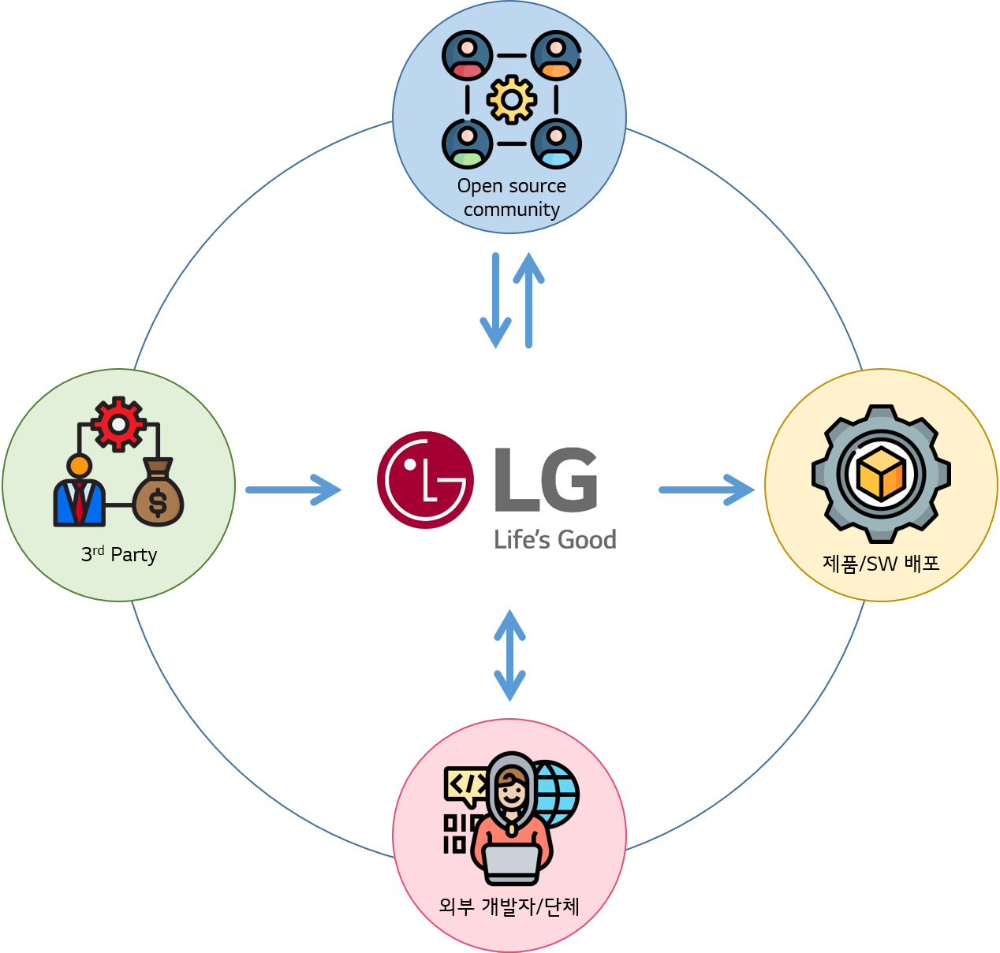

# Open Source Policy

[조직\(Organization\)](../organization/ospo.md)을 구성하였다면, 다음은 정책이 필요합니다. Open Source Policy는 Software를 배포하는 조직이 Open Source를 사용 혹은 기여할 때 지식 재산을 보호하고 Compliance Risk를 완화하기 위해 필요한 것으로, 조직이 효과적으로 Open Source Compliance 활동을 진행하기 위해서는 각 회사가 배포하는 Software 형태, 사업 형태에 따라 그에 맞는 정책이 필요합니다.

다음은 LG전자에서 어떻게 Open Source Policy를 수립하여 OSC 활동을 진행하고 있는지 공개합니다.

 

## LG전자 Open Source Policy

LG전자 Open Source Policy는 LG전자가 배포하는 모든 Software 개발시, LG전자에서 개발한 Software를 Open Source로 공개하거나 Open Source Community에 기여 시에 적용됩니다.  
따라서 Software를 배포하는 LG전자 전 사업부 및 연구소에서는 이를 준수해야 합니다.

LG전자 Open Source Policy는 다음과 같이 구성되어 있습니다.

<table>
  <thead>
    <tr>
      <th style="text-align:left">Policy</th>
      <th style="text-align:left">&#xB0B4;&#xC6A9;</th>
    </tr>
  </thead>
  <tbody>
    <tr>
      <td style="text-align:left">
        
Open Source

        
&#xC0AC;&#xC6A9; Policy

      </td>
      <td style="text-align:left">LG&#xC804;&#xC790;&#xAC00; &#xBC30;&#xD3EC;&#xD558;&#xAE30; &#xC704;&#xD55C;
        Software&#xC5D0; Open Source&#xB97C; &#xC0AC;&#xC6A9;&#xD560; &#xB54C;
        &#xC9C0;&#xC2DD; &#xC7AC;&#xC0B0; &#xBCF4;&#xD638;&#xC640; Compliance Risk
        &#xC644;&#xD654;&#xB97C; &#xC704;&#xD574; &#xC900;&#xC218;&#xD574;&#xC57C;
        &#xD558;&#xB294; &#xC815;&#xCC45;&#xC785;&#xB2C8;&#xB2E4;.</td>
    </tr>
    <tr>
      <td style="text-align:left">3rd Party Software &#xC0AC;&#xC6A9; Policy</td>
      <td style="text-align:left">LG&#xC804;&#xC790;&#xAC00; &#xBC30;&#xD3EC;&#xD558;&#xACE0;&#xC790; &#xD558;&#xB294;
        Software&#xC5D0; &#xD3EC;&#xD568;&#xB41C; 3rd Party Software&#xC5D0; &#xB300;&#xD55C;
        Open Source Compliance&#xB97C; &#xC704;&#xD574; &#xC900;&#xC218;&#xD574;&#xC57C;
        &#xD558;&#xB294; &#xC815;&#xCC45;&#xC785;&#xB2C8;&#xB2E4;.</td>
    </tr>
    <tr>
      <td style="text-align:left">
        
Open Source

        
&#xAE30;&#xC5EC; Policy

      </td>
      <td style="text-align:left">LG&#xC804;&#xC790;&#xC5D0;&#xC11C; &#xAC1C;&#xBC1C;&#xD55C; Software&#xB97C;
        Open Source Community&#xC5D0; &#xAE30;&#xC5EC; &#xC2DC; &#xC900;&#xC218;&#xD574;&#xC57C;
        &#xD558;&#xB294; &#xC815;&#xCC45;&#xC785;&#xB2C8;&#xB2E4;.</td>
    </tr>
    <tr>
      <td style="text-align:left">
        
&#xC678;&#xBD80; &#xD074;&#xB808;&#xC784;

        
&#xB300;&#xC751; Policy

      </td>
      <td style="text-align:left">&#xC678;&#xBD80;&#xB85C;&#xBD80;&#xD130; &#xD074;&#xB808;&#xC784;&#xC744;
        &#xBC1B;&#xC558;&#xC744; &#xB54C; &#xD6A8;&#xACFC;&#xC801;&#xC73C;&#xB85C;
        &#xB300;&#xC751;&#xD558;&#xAE30; &#xC704;&#xD574; &#xC900;&#xC218;&#xD574;&#xC57C;
        &#xD558;&#xB294; &#xC815;&#xCC45;&#xC785;&#xB2C8;&#xB2E4;.</td>
    </tr>
  </tbody>
</table>
