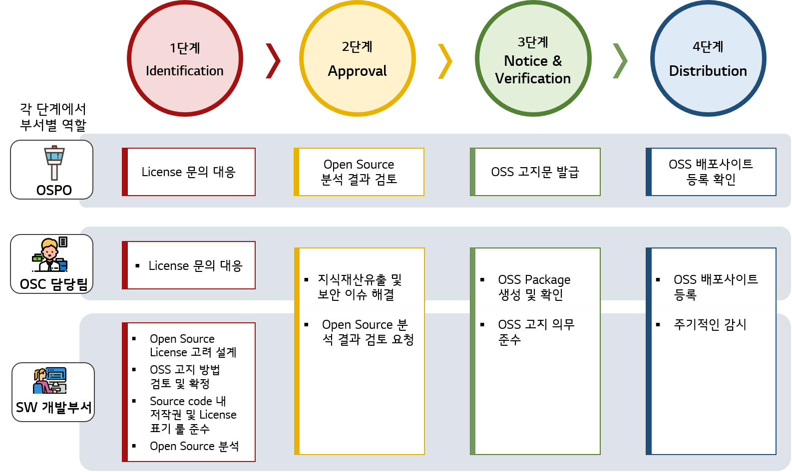

# OSC Process

[Open Source Policy](../../policy/osc_policy.md)를 정하였다면, 이를 준수하기 위해 필요한 활동들이 있습니다. 기업에서 효과적으로 Open Source Policy를 전파하기 위해서는 이를 위한 활동 및 요구사항을 Process로 구축하는 것이 효율적입니다.

LG전자 Open Source Policy 중 Open Source 사용 Policy를 위한 OSC Process를 공개합니다.

 

## LG전자 OSC Process

LG전자 OSC\(Open Source Compliance\) Process는 Software를 배포하는 조직이 LG전자 Open Source Policy를 준수하기 위한 세부적인 활동 가이드를 제공하고 있습니다. 이에 각 Process 단계에서 [부서](../../organization/ospo.md)별 역할을 다음과 같이 확인하실 수 있습니다.

단계별 활동 및 요구사항은 다음과 같습니다.

- [1단계 Identification](1-identification.md)
- [2단계 Approval](2-approval.md)
- [3단계 Notice & Verification](3-notice-and-verification.md)
- [4단계 Distribution](4-distribution.md)
